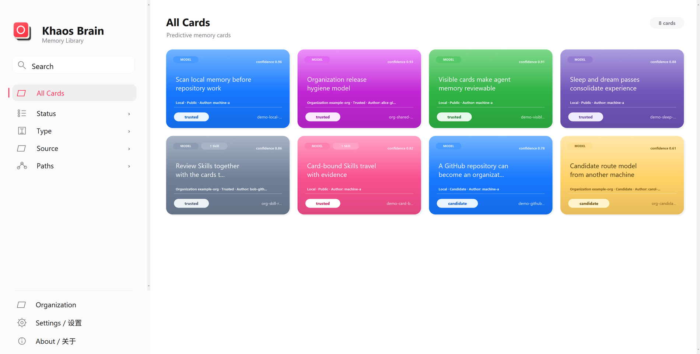
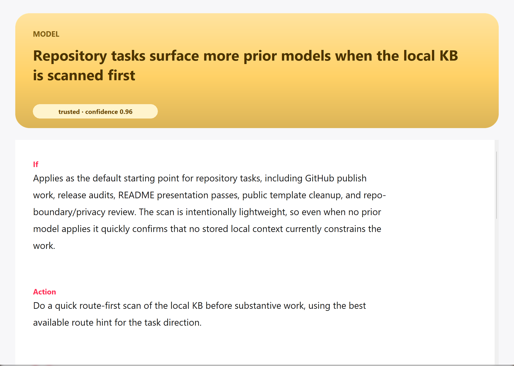

# Khaos Brain

- Repository head (`main`) / 仓库主线（`main`）: `v0.2.0`
- Latest released version / 最新已发布版本: `v0.2.0`
- Project name / 项目名称: `Khaos Brain`
- 中文正文在前；后半部分是完整英文镜像。
- Chinese comes first; the second half is a full English mirror.

<p align="center">
  
</p>

一个给 Codex 使用的本地“脑式”记忆系统：醒着工作，睡眠整理，做梦探索，再用桌面卡片界面把这些经验真正看见。

A local brain-like memory system for Codex: work while awake, consolidate in sleep, explore in dreams, and inspect the result through a desktop card library.

## 产品预览 / Product Preview

下面两张图是当前桌面应用的英文 UI 预览，适合作为 GitHub 首页上的第一眼展示。

The two screenshots below show the current desktop app in English UI, intended as the first-look preview on the GitHub page.

| Desktop Library (English UI) | Card Detail (English UI) |
| --- | --- |
|  |  |

## 中文

### 这是什么

`Khaos Brain` 不是一个把提示词、规则和零散笔记塞进文件夹里的仓库。

它更像是一套接在 Codex 身上的“外接大脑”：

- 任务会留下经历
- 经历会被编码成记忆
- 记忆会在真正需要时被回忆出来
- 真实证据会在 `Sleep` 中被整理
- 邻近但还没被完全验证的可能，会在 `Dream` 中被小范围探索
- 系统自己的运行机制会在 `Architect` 中被克制地维护

所以它想做的，不只是“记住一条规则”，而是尽量模仿人类大脑处理经验的节律：

- 醒着时做事
- 做完后留下痕迹
- 睡眠时整理
- 做梦时联想
- 下午审阅和优化维护机制
- 下次遇到类似情境时更快想起什么更可能有效

### 为什么它像一个“脑”，而不是一个规则盒子

真实任务从来不是干净整齐的。

它们会带着上下文、失误、修正、偏好、例外和重复模式一起出现。`Khaos Brain` 这个名字，就是想强调这件事：

- 进入系统的经验，起点往往是混乱的
- 系统要做的不是把混乱假装成单条规则
- 而是把这些经验整理成可检索、可审查、可版本化的模型关系

也就是说，它更关心的是：

- 在什么场景下
- 做了什么动作
- 更可能发生什么结果
- 如果换一条路径，又更可能发生什么

这也是它和很多普通“记忆功能”最大的区别。

### 它和普通记忆功能哪里不一样

- 它保存的不只是“以后这样做”，而是更像“如果这样做，更可能发生什么”。
- 它不只保留一个结论，也可以保留 alternatives 和对比路径。
- 它不只记任务经验，也记用户偏好、协作方式和 Codex 自己的运行时行为。
- 它不是黑盒数据库，而是文件型、可审查、可 Git 版本化的结构化记忆系统。

所以它不是在造一个“会背规则的小本子”，而是在造一个对经验有整理能力的脑式系统。

### 它到底在建模什么

这套系统至少在建三类模型：

1. 任务模型
   某类发布、调试、写作、协作任务里，什么路径更可能成功。
2. 用户模型
   某个用户更偏好什么结构、什么说明顺序、什么交付边界。
3. 运行时模型
   Codex 在什么提示、流程、工具条件下更容易漏什么，改完后什么更稳。

因此它保存的不只是“结论”，也包括：

- 条件
- 动作
- 结果
- 修正前后的差异
- 下一次应该如何操作

### Sleep、Dream 和 Architect

这个仓库现在把维护拆成三条不同的“脑活动”节律：

- `KB Sleep`
  整理真实发生过的任务证据，把 observation、history 和候选经验慢慢压成更稳的结构；它可以通过 AI-authored semantic review 谨慎改写、升降级或废弃卡片，但一次最多自动修改 3 张 trusted 卡，默认每天 `12:00` 运行。
- `KB Dream`
  对邻近但还没被充分验证的机会做一次有边界的小实验，帮助系统发现潜在新模式，默认每天 `13:00` 运行。
- `KB Architect`
  审阅 Sleep、Dream、安装器、自动化、回滚、验证和 proposal 队列这些运行机制本身；它只用 `Evidence / Impact / Safety` 三项判断，不维护卡片内容，默认每天 `14:00` 运行。

它们不会并发混跑，而且都由安装器写入 Codex 的 automations。自动化规格不锁定某个模型版本；它记录 `model_policy = "strongest-available"` 和 `reasoning_effort_policy = "deepest"`，安装器会在每台机器上解析成当前可用的最强通用 GPT 模型和该模型支持的最深 reasoning。

所以当你把仓库换到另一台机器时，只要重新让 Codex 安装一次，这套“醒着做事, 睡着整理, 做梦扩边, 下午审阅机制”的维护节律就会一起恢复。

### 它和 Codex 的关系

这不是一个“换成任何 AI 都能直接照抄运行”的通用模板。

它明确依赖 Codex 已经提供的能力，例如：

- skills / preflight invocation
- 仓库级指令，例如 `AGENTS.md`
- automations / scheduled runs
- 本地 Python 脚本执行
- 仓库里的检索、maintenance 和 write-back 流程

也正因为它依赖 Codex，这套系统才不需要用户持续盯着维护：

- Codex 可以在任务开始前先检索已有经验
- Codex 可以在任务结束后把 observation 写回 history 或 candidates
- Codex 可以按定时规则自动跑 sleep / dream / architect maintenance
- 用户不需要天天手工检查这个库有没有整理、有没有继续长经验

### 如果你只是想使用它

默认路径应该是：

1. 把这个仓库发给 Codex。
2. 明确说你想“在本地安装并使用这套系统”。
3. 让 Codex 完成安装、检查、接入和后续维护。

对大多数人来说，这比先自己读完整个 README、再手动敲所有命令更自然，也更接近这个项目本来的使用方式。

### 如果你只是想打开桌面版

从 `v0.2.0` 开始，GitHub Release 会附带 Windows 预览版入口 `KhaosBrain.exe`：

- 到 [GitHub Releases](https://github.com/liuyingxuvka/Khaos-Brain/releases/latest) 下载 `KhaosBrain.exe`
- 把它放在这个仓库目录里，或通过命令行参数 `--repo-root` 指向这个仓库
- 双击后即可浏览卡片；它只打包查看器代码和公开图标资源
- 它不会把 `kb/private/`、`kb/history/`、`kb/candidates/` 或真实经验卡片封进二进制
- 源码入口仍然是 `python scripts/kb_desktop.py --repo-root . --language en`

### 手动安装与检查（可选）

如果你是协作者，或者你就是想手动跑一遍：

```bash
python scripts/install_codex_kb.py --json
python scripts/install_codex_kb.py --check --json
```

安装器会做三类事情：

- 安装全局 preflight / launcher，让 Codex 知道在仓库任务前先检索这套 KB
- 在 `$CODEX_HOME/AGENTS.md` 下写入或刷新 repo-managed 的全局默认约束 block，让 KB preflight / postflight 变成另一台机器也能继承的强默认规则层
- 在 `$CODEX_HOME/automations/` 下刷新 repo-managed 的 `KB Sleep`、`KB Dream` 和 `KB Architect`，并按 `strongest-available` / `deepest` 策略解析当前机器的自动化运行模型

安装完成后，`python scripts/install_codex_kb.py --check --json` 会直接返回一个结构化 checklist。跨机器时，至少应看到这些项目全部通过：

- 全局 predictive KB skill / launcher 已安装
- 全局 skill 开启 implicit invocation
- 全局 skill prompt 明确要求 preflight 与 postflight
- `$CODEX_HOME/AGENTS.md` 中存在 repo-managed 的 KB 默认约束 block
- 这个 global AGENTS block 明确提到 `$predictive-kb-preflight`
- 这个 global AGENTS block 明确要求 non-trivial 任务做 explicit KB postflight check
- `KB Sleep` automation 存在且配置正确，包括模型策略与解析后的运行配置
- `KB Dream` automation 存在且配置正确，包括模型策略与解析后的运行配置
- `KB Architect` automation 存在且配置正确，包括模型策略与解析后的运行配置
- `strong_session_defaults` 为通过

如果其中任一项失败，就不该把这台机器视为“已经完整装好”。

### 本地桌面卡片查看器（实验性）

如果你想人工浏览这套记忆库，可以打开本地桌面窗口：

```bash
python scripts/kb_desktop.py --repo-root . --language en
```

这个入口不启动浏览器，不需要本地 web 服务，也不依赖 Electron 或 Node。它使用 Python 标准库的桌面窗口读取同一套文件型 KB：左侧按路线索引导航，右侧以卡片封面的方式查看预测模型。`--language zh-CN` 可以显式切到中文显示层，`--language en` 则适合做英文预览和发布截图。

如果需要 Windows exe、桌面快捷方式或 Codex 打开 UI 的 skill，见 `docs/windows_desktop_app.md`。

无界面检查可以运行：

```bash
python scripts/kb_desktop.py --repo-root . --check
```

### 公开仓库里放什么，不放什么

这个公开仓库默认放的是：

- schema
- 检索、记录、maintenance 工具
- skills、prompt、安装器和测试
- 可公开的结构和示例

默认不应该顺手公开：

- live private cards
- 真实 `kb/history`
- 真实 `kb/candidates`
- 任何用户特定、敏感、未确认可公开的经验数据

### 如果你是开发者

建议从这几个入口开始：

- `PROJECT_SPEC.md`
- `.agents/skills/local-kb-retrieve/`
- `local_kb/`
- `tests/`

### Repository Layout

```text
.
├─ AGENTS.md
├─ CHANGELOG.md
├─ PROJECT_SPEC.md
├─ README.md
├─ VERSION
├─ docs/
├─ .agents/
├─ kb/
├─ local_kb/
├─ schemas/
├─ scripts/
├─ templates/
└─ tests/
```

## English Mirror

### What This Is

`Khaos Brain` is not a repository that stuffs prompts, rules, and scattered notes into folders.

It is closer to an external brain wired onto Codex:

- tasks leave behind experiences
- experiences are encoded into memory
- memory is recalled when it is actually needed
- real evidence is consolidated during `Sleep`
- nearby but not-yet-fully-validated possibilities are explored in a bounded way during `Dream`
- the system's own operating mechanisms are maintained conservatively during `Architect`

So its goal is not merely to “remember one rule.” It is trying to imitate the rhythm with which a human brain handles experience:

- act while awake
- leave traces after acting
- consolidate during sleep
- make associations during dreams
- review and improve maintenance mechanisms in the afternoon
- recall more quickly what is more likely to work the next time a similar situation appears

### Why It Feels Like A Brain Instead Of A Rule Box

Real tasks are never perfectly neat.

They arrive together with context, mistakes, revisions, preferences, exceptions, and recurring patterns. The name `Khaos Brain` is meant to emphasize exactly that:

- the experience entering the system usually begins in chaos
- the system's job is not to pretend that chaos was always one clean rule
- its job is to reorganize that experience into retrievable, reviewable, versioned model relationships

In other words, it cares about:

- under what scenario
- taking what action
- makes what result more likely
- and what becomes more likely if a different path is chosen

That is also the biggest difference between this project and many ordinary “memory features.”

### How It Differs From Ordinary Memory Features

- It does not save only “do this next time.” It saves something closer to “if we do this, this result becomes more likely.”
- It does not keep only one conclusion. It can also preserve alternatives and contrastive paths.
- It models more than task experience. It also models user preferences, collaboration patterns, and Codex's own runtime behavior.
- It is not a black-box database. It is a file-based, inspectable, Git-versioned structured memory system.

So this is not a tiny notebook that can recite rules. It is a brain-like system for organizing experience.

### What It Is Actually Modeling

The system is building at least three kinds of models:

1. Task models
   In a certain kind of release, debugging, writing, or collaboration task, which path is more likely to succeed.
2. User models
   What structure, explanation order, and delivery boundary a specific user is more likely to prefer.
3. Runtime models
   Under which prompts, workflows, or tool conditions Codex is more likely to miss something, and which revised path becomes more stable.

So it preserves more than a conclusion. It also preserves:

- conditions
- actions
- results
- the difference between the weaker path and the revised path
- how the next run should operate

### Sleep, Dream, And Architect

The repository now separates maintenance into three different kinds of “brain activity”:

- `KB Sleep`
  consolidates evidence from real tasks, gradually compressing observations, history, and candidate lessons into more stable structures; it can cautiously rewrite, promote, demote, or deprecate cards through AI-authored semantic review, with at most 3 trusted cards modified per run, and runs by default every day at `12:00`
- `KB Dream`
  runs one bounded experiment on nearby but under-validated opportunities, helping the system discover possible new patterns, and runs by default every day at `13:00`
- `KB Architect`
  reviews the operating mechanisms around Sleep, Dream, installation, automation, rollback, validation, and the proposal queue; it uses only `Evidence / Impact / Safety`, does not maintain card content, and runs by default every day at `14:00`

These lanes do not run concurrently, and all three are provisioned into Codex automations by the installer. The automation specs do not pin a model version; they record `model_policy = "strongest-available"` and `reasoning_effort_policy = "deepest"`, and the installer resolves them on each machine to the strongest available general GPT model and the deepest reasoning level that model supports.

So when the repository moves to another machine, asking Codex to install it again restores the same “work while awake, consolidate while asleep, expand while dreaming, review the mechanisms afterward” maintenance rhythm there too.

### How It Relates To Codex

This is not a generic template that runs the same way with any AI.

It explicitly depends on capabilities that Codex already provides, such as:

- skills / preflight invocation
- repository-level instructions such as `AGENTS.md`
- automations / scheduled runs
- local Python script execution
- repository-native retrieval, maintenance, and write-back flows

And because it depends on Codex, the system does not require a human to babysit it continuously:

- Codex can retrieve prior experience before a task begins
- Codex can write observations back to history or candidates after a task ends
- Codex can run sleep / dream / architect maintenance on a schedule
- the user does not have to keep checking whether the library was consolidated or extended

### If You Just Want To Use It

The default path should be:

1. Send this repository to Codex.
2. State clearly that you want to install and use the system locally.
3. Let Codex handle installation, checks, integration, and ongoing maintenance.

For most people, this is more natural than reading the entire README first and manually typing every command, and it is also closer to the way the project is meant to be used.

### If You Just Want The Desktop App

Starting with `v0.2.0`, GitHub Releases include the Windows preview entry `KhaosBrain.exe`:

- download `KhaosBrain.exe` from [GitHub Releases](https://github.com/liuyingxuvka/Khaos-Brain/releases/latest)
- place it in this repository directory, or pass `--repo-root` on the command line to point it at this repository
- double-click it to browse cards; it bundles only viewer code and public icon assets
- it does not bundle `kb/private/`, `kb/history/`, `kb/candidates/`, or real memory cards into the binary
- the source entry remains `python scripts/kb_desktop.py --repo-root . --language en`

### Manual Install And Check (Optional)

If you are a collaborator, or you simply want to run it yourself:

```bash
python scripts/install_codex_kb.py --json
python scripts/install_codex_kb.py --check --json
```

The installer does three main things:

- installs the global preflight / launcher so Codex knows to consult this KB before repository work
- writes or refreshes a repo-managed defaults block under `$CODEX_HOME/AGENTS.md` so KB preflight / postflight become strong inherited defaults on another machine too
- refreshes the repo-managed `KB Sleep`, `KB Dream`, and `KB Architect` automations under `$CODEX_HOME/automations/`, resolving the current machine's automation runtime from the `strongest-available` / `deepest` policy

After installation, `python scripts/install_codex_kb.py --check --json` returns a structured checklist directly. On another machine, you should treat the install as complete only when these checks all pass:

- the global predictive KB skill / launcher exists
- the global skill enables implicit invocation
- the global skill prompt explicitly requires preflight and postflight reminders
- `$CODEX_HOME/AGENTS.md` contains the repo-managed predictive KB defaults block
- that global AGENTS block mentions `$predictive-kb-preflight`
- that global AGENTS block requires an explicit KB postflight check for non-trivial work
- `KB Sleep` exists and matches the repository automation spec, including model policy and resolved runtime
- `KB Dream` exists and matches the repository automation spec, including model policy and resolved runtime
- `KB Architect` exists and matches the repository automation spec, including model policy and resolved runtime
- `strong_session_defaults` is true

If any required checklist item fails, the machine should be treated as only partially installed.

### Local Desktop Card Viewer (Experimental)

To browse the memory library manually, open the local desktop window:

```bash
python scripts/kb_desktop.py --repo-root . --language en
```

This entry point does not start a browser, a local web server, Electron, or Node. It uses Python's standard desktop toolkit and reads the same file-based KB: route navigation stays on the left, and predictive model cards are shown as cover-like cards on the right. `--language zh-CN` switches explicitly to the Chinese display layer, while `--language en` is useful for English previews and release screenshots.

The desktop viewer supports a local display-language setting. English card fields remain the canonical source; optional `i18n.zh-CN` fields are filled by sleep maintenance and used for Chinese display with English fallback.

For the Windows exe, desktop shortcut, or Codex UI-opening skill, see `docs/windows_desktop_app.md`.

For a headless check:

```bash
python scripts/kb_desktop.py --repo-root . --check
```

### What This Public Repository Includes And Excludes

This public repository is meant to include:

- schema
- retrieval, recording, and maintenance tools
- skills, prompts, installer logic, and tests
- public-safe structures and examples

It should not casually publish:

- live private cards
- real `kb/history`
- real `kb/candidates`
- any user-specific, sensitive, or not-yet-approved experience data

### If You Are A Developer

A good starting order is:

- `PROJECT_SPEC.md`
- `.agents/skills/local-kb-retrieve/`
- `local_kb/`
- `tests/`

### Repository Layout

```text
.
├─ AGENTS.md
├─ CHANGELOG.md
├─ PROJECT_SPEC.md
├─ README.md
├─ VERSION
├─ docs/
├─ .agents/
├─ kb/
├─ local_kb/
├─ schemas/
├─ scripts/
├─ templates/
└─ tests/
```
