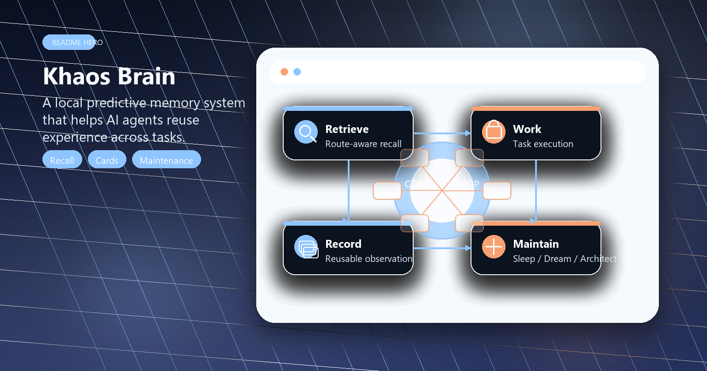
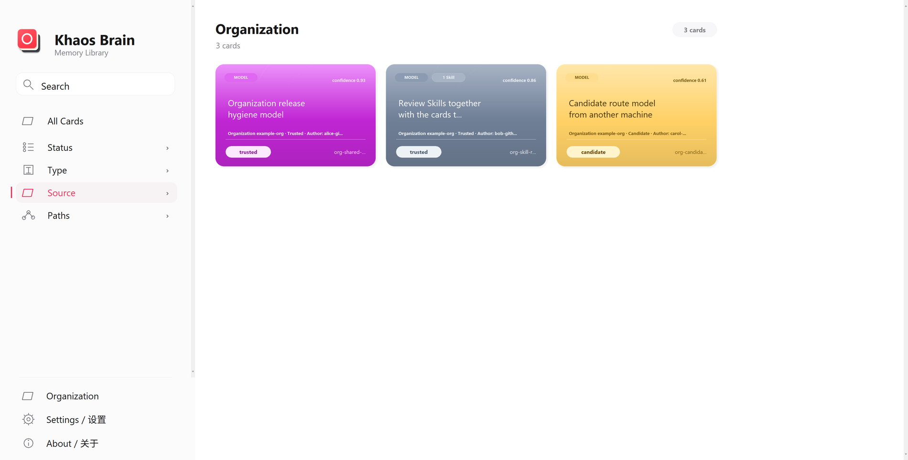

# Khaos Brain

<!-- README HERO START -->
<p align="center">
  
</p>

<p align="center">
  <strong>A local predictive memory system that helps AI agents reuse experience across tasks.</strong>
</p>
<!-- README HERO END -->

- Repository head (`main`) / 仓库主线（`main`）: `v0.4.6`
- Latest released version / 最新已发布版本: `v0.4.6`
- Project name / 项目名称: `Khaos Brain`
- 中文正文在前；后半部分是完整英文镜像。 / Chinese comes first; the second half is a full English mirror.

<p align="center">
  
</p>

`Khaos Brain` 是一套给 AI agent 使用的“脑式”经验系统：它把任务经验、预测模型、用户偏好、运行时教训和可共享 Skill 组织成可观察、可维护、可 Git 版本化的卡片库。

`Khaos Brain` is a “brain-like” experience system for AI agents: it organizes task experience, predictive models, user preferences, runtime lessons, and shareable skills into a card library that is observable, maintainable, and Git-versionable.

当前发行版是 Codex-first：安装器、全局 Skill、`AGENTS.md` 默认规则和 automations 已经为 Codex 打通。更准确地说，它不是概念上只能给 Codex 用的产品，而是一套 AI agent 经验层；只要宿主 agent 能在任务前调用检索、任务后写回证据、运行本地脚本、执行定时维护、加载工作流/Skill，并读写 Git 仓库，就可以按同一结构适配。

The current release is Codex-first: the installer, global skills, default rules in `AGENTS.md`, and automations have already been integrated with Codex. More precisely, it is not a product conceptually limited to Codex, but rather an experience layer for AI agents; as long as the host agent can call and retrieve data before a task, write back evidence after a task, run local scripts, perform scheduled maintenance, load workflows/Skills, and read/write Git repositories, it can be adapted to the same structure.

## 产品预览 / Product Preview

| Local + Organization Cards | Organization Source | Card Detail |
| --- | --- | --- |
|  |  |  |

## 中文 / Chinese comes first; English comes latter below.

### 它解决什么问题

大多数 AI 记忆功能只是在保存“以后记得这样做”。这太浅了。

真实协作里更有价值的是经验模型：

- 在什么条件下
- 采取什么动作
- 更可能得到什么结果
- 哪条路线失败过，哪条路线更稳
- 这个经验来自谁、在哪台机器上、是否已经被信任
- 如果一个 Skill 很关键，它到底在哪类任务里有用

`Khaos Brain` 把这些内容做成卡片。卡片不是黑盒向量，不是散乱笔记，也不是只能靠人手维护的规则列表。它们是文件型、可阅读、可搜索、可审查、可合并、可回滚的经验单元。

### 为什么它像一个“脑”

这套系统刻意模拟一种脑式节律：

- 醒着做任务：agent 在任务前检索相关经验，在任务后写回观察。
- 睡眠整理：`KB Sleep` 合并重复卡片、拆分臃肿卡片、修正低质量经验、维护可信度。
- 做梦探索：`KB Dream` 对相近但未充分验证的机会做小范围探索。
- 架构审阅：`KB Architect` 审查安装器、自动化、回滚、proposal 队列和维护机制本身。
- 组织维护：组织库也有自己的维护流程，用来整理共享候选卡、共享 Skill 和审查结果。

所以它不是只“记住一句提示词”。它在持续整理经验、模型和工具使用方式，让下一次任务更像是从已有经验出发，而不是从空白上下文出发。

安装完成后，这些节律可以由本机自动任务持续运行：日常任务前后自动检索和写回，随后由 Sleep、Dream、Architect 和组织维护在各自时间窗口整理、验证、审阅和交换经验。人仍然可以通过卡片、报告、Git diff 和回滚记录审查结果，但不需要每天手工驱动整套经验库。

### 个人模式和组织模式

默认是个人模式：每台电脑维护自己的本地 KB。这样保留了个人偏好、本机上下文、私有历史和本地 Skill 使用痕迹。

组织模式是可选增强：在 Settings 中填入并验证一个 Khaos organization KB GitHub 仓库后，桌面 UI 会启用组织来源、组织卡片、组织 Skill registry 和贡献/维护管线。

这不是把所有人的偏好混在一起。设计边界是：

- 个人偏好默认留在本地。
- 可复用的任务模型、工程经验、维护路线和 Skill 使用经验可以进入组织候选池。
- 组织卡片会带来源、作者、状态、可信度和只读标记。
- 本地优先检索；组织卡片同步到本地缓存后，真正使用过才会被采纳成本地经验。
- 被采纳的组织经验以后由本地维护流程继续合并、拆分或改进，再作为反馈回流组织候选池。

### 组织共享的不只是 Skill

组织能力的核心不是“把 Skill 文件复制给同事”。更重要的是共享经验模型。

一张组织卡片可以说明：

- 这个经验适用在哪类任务
- 使用什么动作或路线
- 预期能改善什么结果
- 可信度和状态是什么
- 作者是谁
- 是否依赖某个 Skill

如果卡片依赖 Skill，Skill 会作为卡片绑定的附件进入组织候选流程。组织维护会同时审查卡片和 Skill：候选 Skill 不自动安装，只有通过审核、记录版本和内容哈希的 approved Skill 才可以被其他机器按策略安装。每台电脑只保留同一 Skill 的最新可用版本；原始作者的更新通过新的卡片/候选包进入组织维护。

这让 Skill 共享有上下文：别人不只是拿到一个脚本，而是知道它为什么存在、什么时候该用、有什么边界。

### 为什么用 GitHub 做组织 KB

组织共享库可以直接是一个私有 GitHub 仓库。

这样做的好处很现实：

- 不需要单独部署记忆服务器。
- 小团队和组织可以用现成的 GitHub 权限、分支、review、Actions 和 rollback。
- 卡片、候选池、导入记录和 Skill registry 都是可审查文件。
- 自动维护可以提交提案或分支，GitHub 负责检查、合并和历史追踪。
- 如果自动维护出错，人可以在 GitHub 上回退。
- 对大多数团队来说，私有仓库已经足够免费、简单、可管理。

也就是说，组织经验共享不依赖一个昂贵或封闭的云记忆平台。它可以从一个普通 GitHub 仓库开始。

### 为什么它比普通 AI 工作流/记忆产品更值得尝试

- **可观察**：卡片能直接打开看，来源、作者、可信度、状态和 Skill 依赖都在 UI 里。
- **可维护**：Sleep / Dream / Architect / organization maintenance 会把经验库当成活系统整理。
- **本地优先**：个人 KB 不被组织模式覆盖；个人偏好和私有经验默认留在本机。
- **组织可共享**：团队共享的是经验模型、任务路线、维护方法和经过审查的 Skill，而不只是零散笔记。
- **Git 原生**：历史、diff、review、回滚、私有权限和自动合并都可以复用 GitHub。
- **开源可改**：结构、卡片、脚本、Skill 和 UI 都是文件与源码，不是封闭 SaaS。
- **不假装全自动万能**：高价值组织共享仍走候选、审查、维护和可回滚流程。

### 它依赖什么样的 AI agent

当前开箱即用目标是 Codex，因为 Codex 已经有这些能力：

- repository-level instructions，例如 `AGENTS.md`
- skills / preflight invocation
- 本地脚本执行
- automations / scheduled runs
- GitHub 和文件系统工作流
- 任务结束后的 observation / postflight 写回

如果未来适配其他 AI agent，对方至少需要类似能力：能在任务前读取经验、在任务后写回证据、加载可复用 workflow/Skill、执行本地维护脚本，并能安全地读写 Git 仓库。

### 如果你只是想使用它

最自然的方式是把这个仓库交给你的 AI agent，然后说：

```text
请在本机安装并启用这套 Khaos Brain 经验系统，安装后运行检查。
```

Codex 当前会按仓库规则默认执行：

```bash
python scripts/install_codex_kb.py --json
python scripts/install_codex_kb.py --check --json
```

检查通过后，这台机器会获得全局 preflight Skill、KB postflight 规则、`KB Sleep`、`KB Dream`、`KB Architect`，以及组织贡献/组织维护入口。

### 桌面卡片查看器

Windows Release 附带预览版 `KhaosBrain.exe`：

- 到 [GitHub Releases](https://github.com/liuyingxuvka/Khaos-Brain/releases/latest) 下载 `KhaosBrain.exe`
- 把它放在这个仓库目录里，或通过命令行参数 `--repo-root` 指向这个仓库
- 双击后即可浏览卡片

源码入口：

```bash
python scripts/kb_desktop.py --repo-root . --language en
```

中文界面：

```bash
python scripts/kb_desktop.py --repo-root . --language zh-CN
```

无界面检查：

```bash
python scripts/kb_desktop.py --repo-root . --check
```

桌面查看器不启动浏览器，不需要本地 web 服务，也不依赖 Electron 或 Node。它读取同一套文件型 KB，并在组织模式下显示本地/组织来源、作者、状态、可信度和 Skill 依赖。

更多 Windows exe、桌面快捷方式和 Codex 打开 UI 的说明见 `docs/windows_desktop_app.md`。组织模式的设计细节见 `docs/organization_mode_plan.md`。

### 自愿支持项目维护

如果这个项目对你有帮助，你可以通过下面的链接自愿支持项目维护：

[通过 PayPal 请开发者喝杯咖啡](https://paypal.me/Yingxuliu)

所有支持都是自愿的，不代表购买技术支持、质保、优先服务、商业授权或功能定制。

### 公开仓库里放什么，不放什么

这个公开仓库默认放的是：

- schema
- 检索、记录、maintenance 工具
- skills、prompt、安装器和测试
- 可公开的结构、截图和示例

默认不应该顺手公开：

- live private cards
- 真实 `kb/history`
- 真实 `kb/candidates`
- 任何用户特定、敏感、未确认可公开的经验数据

### 如果你是开发者

建议从这几个入口开始：

- `PROJECT_SPEC.md`
- `.agents/skills/local-kb-retrieve/`
- `local_kb/`
- `tests/`
- `docs/organization_mode_plan.md`

### Repository Layout

```text
.
├─ AGENTS.md
├─ CHANGELOG.md
├─ PROJECT_SPEC.md
├─ README.md
├─ VERSION
├─ docs/
├─ .agents/
├─ kb/
├─ local_kb/
├─ schemas/
├─ scripts/
├─ templates/
└─ tests/
```

## English

### What Khaos Brain Is

`Khaos Brain` is a brain-like experience system for AI agents. It organizes task experience, predictive models, user preferences, runtime lessons, and shareable Skills into visible, maintainable, Git-versioned cards.

The current release is Codex-first: the installer, global Skill, `AGENTS.md` defaults, and automations are already wired for Codex. More precisely, this is not conceptually limited to Codex. It is an AI-agent experience layer. Any host agent with preflight retrieval, post-task write-back, local script execution, scheduled maintenance, reusable workflow/Skill loading, and Git repository access can adapt the same structure.

### The Problem It Solves

Most AI memory features save something like “remember to do this next time.” That is too shallow.

The useful unit in real work is an experience model:

- under which conditions
- taking which action
- makes which result more likely
- which route failed, and which route became more stable
- who contributed the lesson, from which source, and whether it is trusted
- if a Skill matters, in which task class it actually helps

`Khaos Brain` turns those models into cards. Cards are not an opaque vector store, scattered notes, or a manually maintained rule list. They are file-based, readable, searchable, reviewable, mergeable, and reversible units of experience.

### Why It Feels Like A Brain

The system deliberately follows a brain-like rhythm:

- Awake work: the agent retrieves relevant experience before a task and writes observations back afterward.
- Sleep consolidation: `KB Sleep` merges repeated cards, splits swollen cards, repairs weak lessons, and maintains confidence.
- Dream exploration: `KB Dream` explores nearby but under-validated opportunities in a bounded way.
- Architecture review: `KB Architect` reviews the installer, automation, rollback, proposal queues, and maintenance machinery itself.
- Organization maintenance: the shared organization KB has its own maintenance path for contributed cards, shared Skills, and review outcomes.

So this is not just a prompt notebook. It continuously organizes experience, models, and tool-use behavior so the next task starts from accumulated evidence instead of an empty context window.

After installation, those rhythms can run through local automations: task preflight and postflight keep retrieving and writing evidence, while Sleep, Dream, Architect, and organization maintenance consolidate, test, review, and exchange experience in their own time windows. Humans can still inspect cards, reports, Git diffs, and rollback records, but the memory library does not require daily manual operation.

### Personal Mode And Organization Mode

Personal mode is the default. Each machine maintains its own local KB, preserving personal preferences, local context, private history, and local Skill-use evidence.

Organization mode is optional. After Settings validates a Khaos organization KB GitHub repository, the desktop UI enables organization sources, organization cards, the organization Skill registry, and the contribution / maintenance pipeline.

The design boundary is intentional:

- personal preferences stay local by default
- reusable task models, engineering experience, maintenance routes, and Skill-use evidence can enter the organization candidate pool
- organization cards carry source, author, status, confidence, and read-only metadata
- local retrieval remains first; organization cards sync into a local cache and become local experience only after actual use
- adopted organization experience is then maintained locally, and meaningful improvements can flow back as organization candidates

### Organization Sharing Is More Than Skill Sharing

The core organization feature is not “copy Skill files to teammates.” The more important layer is shared experience models.

An organization card can explain:

- which task class the lesson applies to
- which route or action to use
- what outcome it predicts
- its status and confidence
- who authored it
- whether it depends on a Skill

When a card depends on a Skill, the Skill travels as a card-bound bundle through the organization candidate flow. Organization maintenance reviews the card and the Skill together. Candidate Skills are not auto-installed. Only approved Skills with pinned version and content hash metadata are eligible for installation on another machine. Each machine keeps the latest usable version of the same Skill; author updates arrive through new card / bundle candidates and are reconciled by maintenance.

That gives Skill sharing context. A teammate receives not only a script, but the experience card that explains why it exists, when to use it, and where its boundaries are.

### Why GitHub Is Enough For An Organization KB

An organization shared KB can be a private GitHub repository.

That has practical advantages:

- no separate memory server to deploy
- existing GitHub permissions, branches, review, Actions, and rollback
- cards, candidate pools, import records, and Skill registries remain inspectable files
- automated maintenance can submit proposals or branches while GitHub handles checks, merge, and history
- if automation makes a bad change, a human can revert it in GitHub
- for many teams, a private repository is already free, simple, and manageable

In other words, organization memory does not need an expensive or closed cloud memory platform. It can start as a normal GitHub repository.

### Why Try This Instead Of Another AI Workflow Or Memory Product

- **Visible**: cards can be opened directly; source, author, confidence, status, and Skill dependencies are shown in the UI.
- **Maintainable**: Sleep / Dream / Architect / organization maintenance treat memory as a living system.
- **Local-first**: organization mode does not overwrite the personal KB; private lessons and preferences stay local by default.
- **Organization-ready**: teams share experience models, task routes, maintenance methods, and reviewed Skills, not just notes.
- **Git-native**: history, diff, review, rollback, private access, and auto-merge can reuse GitHub.
- **Open and customizable**: structure, cards, scripts, Skills, and UI are files and source code, not a closed SaaS box.
- **Honest automation**: high-value shared knowledge still goes through candidates, review, maintenance, and rollback.

### What Kind Of AI Agent It Needs

The out-of-the-box host is currently Codex because Codex already supports:

- repository-level instructions such as `AGENTS.md`
- skills / preflight invocation
- local script execution
- automations / scheduled runs
- GitHub and filesystem workflows
- post-task observation / postflight write-back

To adapt the system to another AI agent, that agent needs comparable capabilities: reading experience before work, writing evidence after work, loading reusable workflows / Skills, running local maintenance scripts, and safely reading and writing Git repositories.

### If You Just Want To Use It

The most natural path is to hand this repository to your AI agent and say:

```text
Install and enable this Khaos Brain experience system on this machine, then run the health check.
```

Codex currently follows the repository rules and runs:

```bash
python scripts/install_codex_kb.py --json
python scripts/install_codex_kb.py --check --json
```

After the check passes, the machine has the global preflight Skill, KB postflight rules, `KB Sleep`, `KB Dream`, `KB Architect`, and the organization contribution / maintenance entry points.

### Desktop Card Viewer

The Windows Release includes the preview `KhaosBrain.exe`:

- download `KhaosBrain.exe` from [GitHub Releases](https://github.com/liuyingxuvka/Khaos-Brain/releases/latest)
- place it in this repository directory, or pass `--repo-root` to point it at this repository
- double-click it to browse cards

Source entry:

```bash
python scripts/kb_desktop.py --repo-root . --language en
```

Chinese UI:

```bash
python scripts/kb_desktop.py --repo-root . --language zh-CN
```

Headless check:

```bash
python scripts/kb_desktop.py --repo-root . --check
```

The desktop viewer does not start a browser, a local web service, Electron, or Node. It reads the same file-based KB and, in organization mode, shows local / organization source, author, status, confidence, and Skill dependency metadata.

For the Windows exe, desktop shortcut, or Codex UI-opening Skill, see `docs/windows_desktop_app.md`. For the organization-mode design, see `docs/organization_mode_plan.md`.

### Voluntary Support

If this project is useful to you, you can support its development here:

[Buy me a coffee via PayPal](https://paypal.me/Yingxuliu)

Contributions are voluntary and do not purchase support, warranty, priority service, commercial rights, or feature requests.

### What This Public Repository Includes And Excludes

This public repository is meant to include:

- schema
- retrieval, recording, and maintenance tools
- skills, prompts, installer logic, and tests
- public-safe structures, screenshots, and examples

It should not casually publish:

- live private cards
- real `kb/history`
- real `kb/candidates`
- any user-specific, sensitive, or not-yet-approved experience data

### If You Are A Developer

A good starting order is:

- `PROJECT_SPEC.md`
- `.agents/skills/local-kb-retrieve/`
- `local_kb/`
- `tests/`
- `docs/organization_mode_plan.md`

### Repository Layout

```text
.
├─ AGENTS.md
├─ CHANGELOG.md
├─ PROJECT_SPEC.md
├─ README.md
├─ VERSION
├─ docs/
├─ .agents/
├─ kb/
├─ local_kb/
├─ schemas/
├─ scripts/
├─ templates/
└─ tests/
```
